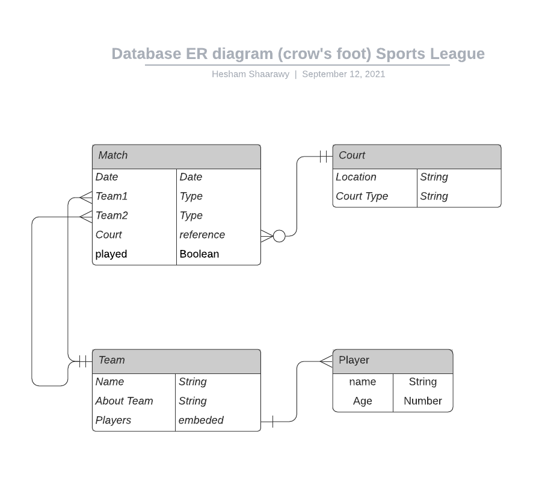
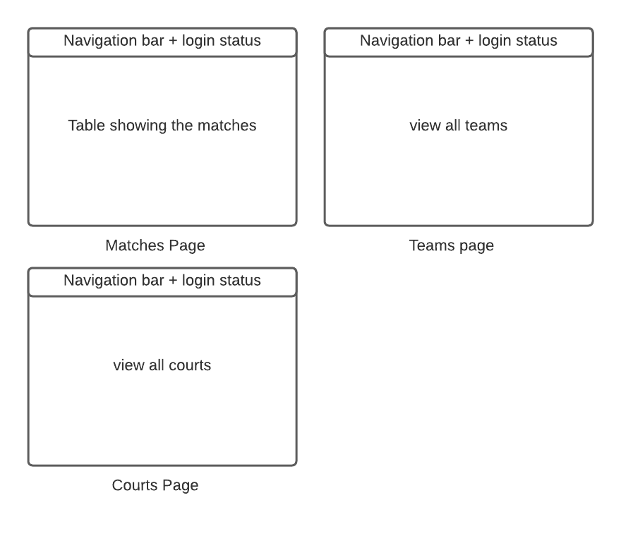

# Project: Sport League.
# Full-stack CRUD Application

# Sports-League: Match board
deployed at: https://sportleague.herokuapp.com/
database: MongoDB Atlas on Azure
## About:
This app is for sports league coordination. Intended to be used by the administrator of the league, coaches and players to have a grib on the matches schedule: when and where teams are playing. 

## Technologies used:
HTML, CSS, JavaScript, Node.js, Express.js, MongoDB, UIkit, Google Oauth2, AJAX, API

 ## user Stories:
 [Trello board](https://trello.com/b/EBia15Y7/sports-league) show the user stories. 

## Entity Relationship Diagram (ERD)

A match uses one court/A court is used by none or many matches  
A Match has one Team as Team 1/ A team has many matches as Team 1  
A Match has one Team as Team 2/ A team has many matches as Team 2  
A Team has many players/ A player belong to one Team  

## Wireframes
here is sample of the wire frames of the three main pages: matches, teams and courts.

